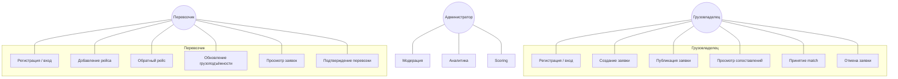
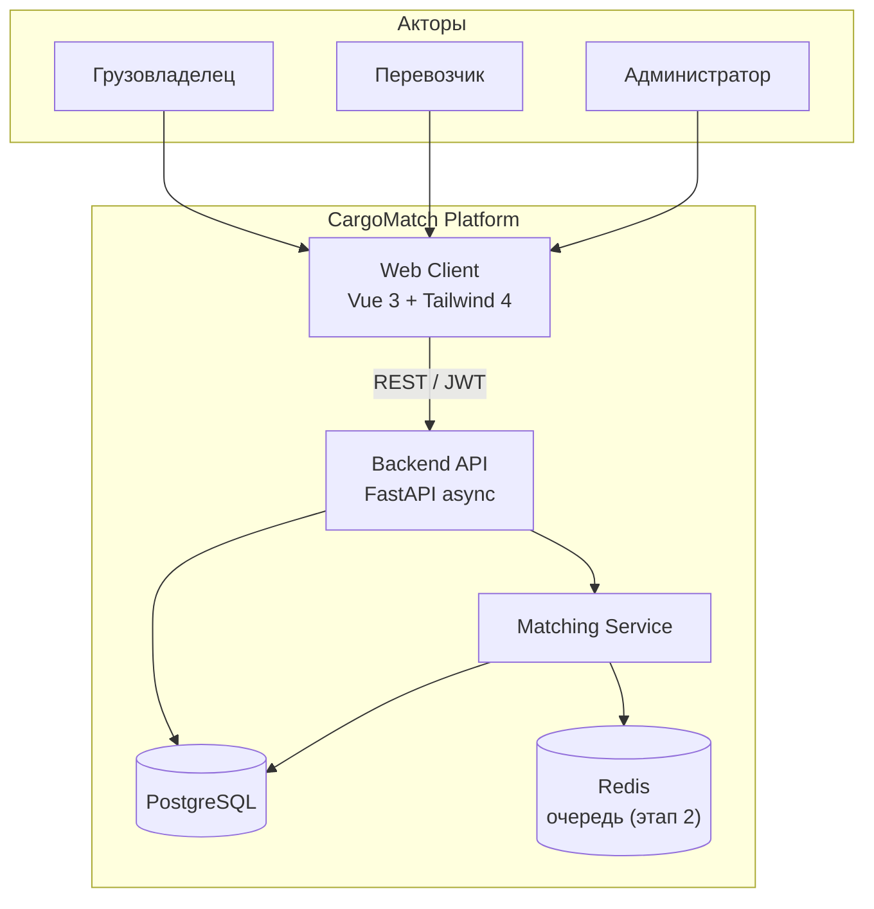
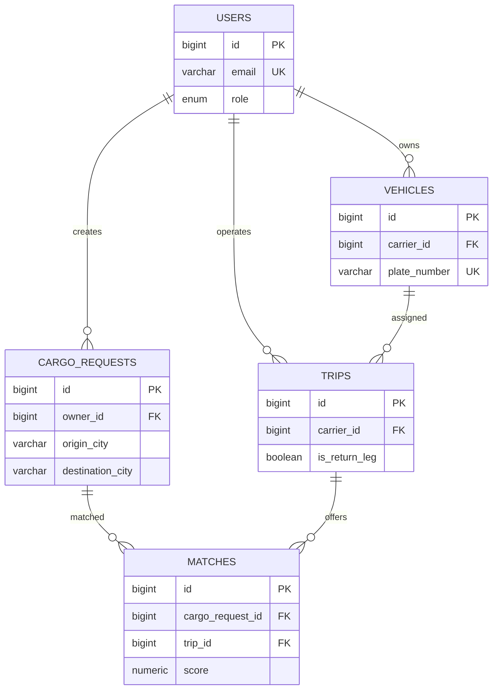

# Архитектура проекта CargoMatch

**Дисциплина:** Разработка серверных приложений  
**Лабораторная работа №1:** Проектирование архитектуры серверного приложения и предметной области  
**Тема сквозного проекта:** Разработка веб-платформы для агрегации и автоматизированного сопоставления заявок на грузоперевозки с учётом обратных рейсов  

---

## 1. Назначение системы

CargoMatch — веб-платформа, которая:

- агрегирует **заявки грузовладельцев** на перевозку между городами;
- собирает **рейсы перевозчиков**, включая **обратные рейсы** (backhaul);
- автоматически **сопоставляет** заявки с подходящими рейсами по маршруту, дате и грузоподъёмности;
- снижает долю **порожних пробегов** за счёт загрузки обратного направления.

Стиль архитектуры на текущем этапе — **модульный монолит** (единый backend-сервис FastAPI с выделенным доменным модулем сопоставления). Это упрощает разработку дипломного проекта и соответствует требованиям Lab#01 по документированию контейнеров.

---

## 2. Ролевая модель

| Роль | Описание |
|------|----------|
| **Грузовладелец (Shipper)** | Публикует заявки на перевозку, выбирает предложения сопоставления |
| **Перевозчик (Carrier)** | Создаёт рейсы, указывает свободную грузоподъёмность и обратные рейсы |
| **Администратор (Admin)** | Модерирует пользователей, просматривает аналитику, настраивает правила matching |

---

## 3. Сценарии использования (Use Cases)

### 3.1. Грузовладелец

| ID | Use Case | Описание |
|----|----------|----------|
| UC-01 | Регистрация и вход | Создание учётной записи, аутентификация по JWT |
| UC-02 | Создание заявки | Указание маршрута, груза, веса, дат погрузки |
| UC-03 | Публикация заявки | Перевод заявки из `draft` в `published` |
| UC-04 | Просмотр сопоставлений | Список рейсов с оценкой `score` и флагом backhaul |
| UC-05 | Принятие match | Подтверждение выбранного рейса |
| UC-06 | Отмена заявки | Перевод в статус `cancelled` |

### 3.2. Перевозчик

| ID | Use Case | Описание |
|----|----------|----------|
| UC-07 | Регистрация и вход | Учётная запись с ролью `carrier` |
| UC-08 | Создание рейса | Маршрут, дата отправления, тип ТС, ёмкость |
| UC-09 | Обратный рейс | Установка `is_return_leg = true` |
| UC-10 | Обновление ёмкости | Изменение `free_capacity_kg` |
| UC-11 | Просмотр заявок | Заявки, подобранные к рейсу |
| UC-12 | Подтверждение перевозки | Принятие match со стороны перевозчика |

### 3.3. Администратор

| ID | Use Case | Описание |
|----|----------|----------|
| UC-13 | Модерация пользователей | Блокировка / активация (`is_active`) |
| UC-14 | Аналитика | Статистика по matches, доля backhaul |
| UC-15 | Настройка scoring | Веса критериев сопоставления (этап 2) |

Диаграмма прецедентов (исходник): [`docs/diagrams/use-cases.mmd`](docs/diagrams/use-cases.mmd)

---

## 4. Доменная модель (ключевые сущности)

| № | Сущность | Назначение |
|---|----------|------------|
| 1 | **User** | Пользователь системы (роли shipper / carrier / admin) |
| 2 | **Vehicle** | Транспортное средство перевозчика (госномер, тип, грузоподъёмность) |
| 3 | **CargoRequest** | Заявка на перевозку груза по маршруту |
| 4 | **Trip** | Рейс перевозчика (в т.ч. обратный) |
| 5 | **Match** | Результат автоматического сопоставления заявки и рейса |

Связи:

- `User` 1:N `CargoRequest` (владелец заявки)
- `User` 1:N `Trip` (перевозчик)
- `User` 1:N `Vehicle`
- `Vehicle` 1:N `Trip` (опционально)
- `CargoRequest` 1:N `Match`, `Trip` 1:N `Match`
- Пара `(cargo_request_id, trip_id)` в `Match` — **UNIQUE** (нет дублей сопоставления)

---

## 5. C4 Model — Container (уровень 2)

Исходные файлы: [`docs/diagrams/c4-containers.mmd`](docs/diagrams/c4-containers.mmd), [`docs/diagrams/c4-containers.puml`](docs/diagrams/c4-containers.puml)

### Описание контейнеров

| Контейнер | Технологии | Ответственность |
|-----------|------------|-----------------|
| **Web Client** | Vue 3, Vite, Tailwind CSS 4, Pinia, Vue Router | UI, формы заявок/рейсов, отображение matches |
| **Backend API** | Python 3.10+, FastAPI, Pydantic v2, Uvicorn | REST `/api/v1`, auth, CRUD, оркестрация |
| **Matching Service** | Python-модуль в backend | Scoring маршрута (прямой / backhaul), ёмкость, даты |
| **PostgreSQL** | 15+ | Персистентное хранение, транзакции, FK |
| **Redis** | 7+ (план) | Очередь фонового пересчёта matches, кэш |

### C4 Level 1 — System Context

[`docs/diagrams/c4-context.mmd`](docs/diagrams/c4-context.mmd)

---

## 6. ER-диаграмма (3NF)

Проектирование выполнено в **3-й нормальной форме**: неключевые атрибуты зависят только от первичного ключа; повторяющиеся группы вынесены в отдельные таблицы (`vehicles`, `matches`).

Исходники: [`docs/diagrams/erd.mmd`](docs/diagrams/erd.mmd), [`docs/diagrams/erd.puml`](docs/diagrams/erd.puml)

### 6.1. Таблица `users`

| Поле | Тип | Ограничения |
|------|-----|-------------|
| id | BIGINT | PK, GENERATED |
| email | VARCHAR(255) | NOT NULL, UNIQUE |
| hashed_password | VARCHAR(255) | NOT NULL |
| full_name | VARCHAR(255) | NOT NULL |
| company_name | VARCHAR(255) | NULL |
| phone | VARCHAR(32) | NULL |
| role | ENUM | NOT NULL |
| is_active | BOOLEAN | NOT NULL, DEFAULT true |
| created_at | TIMESTAMPTZ | NOT NULL, DEFAULT now() |

**Индексы:** `email` (UNIQUE).

### 6.2. Таблица `vehicles`

| Поле | Тип | Ограничения |
|------|-----|-------------|
| id | BIGINT | PK |
| carrier_id | BIGINT | FK → users(id), NOT NULL |
| plate_number | VARCHAR(16) | NOT NULL, UNIQUE |
| vehicle_type | VARCHAR(64) | NOT NULL |
| capacity_kg | NUMERIC(12,2) | NOT NULL, CHECK > 0 |
| capacity_m3 | NUMERIC(12,2) | CHECK > 0 |
| is_active | BOOLEAN | NOT NULL, DEFAULT true |

**Индексы:** `carrier_id`.

### 6.3. Таблица `cargo_requests`

| Поле | Тип | Ограничения |
|------|-----|-------------|
| id | BIGINT | PK |
| owner_id | BIGINT | FK → users(id), NOT NULL |
| origin_city, destination_city | VARCHAR(128) | NOT NULL |
| cargo_description | TEXT | NOT NULL |
| weight_kg | NUMERIC(12,2) | NOT NULL, CHECK > 0 |
| pickup_date_from | DATE | NOT NULL |
| status | ENUM | NOT NULL, DEFAULT draft |
| created_at, updated_at | TIMESTAMPTZ | NOT NULL |

**Индексы:** `owner_id`, `origin_city`, `destination_city`, `status`.

### 6.4. Таблица `trips`

| Поле | Тип | Ограничения |
|------|-----|-------------|
| id | BIGINT | PK |
| carrier_id | BIGINT | FK → users(id), NOT NULL |
| vehicle_id | BIGINT | FK → vehicles(id), NULL |
| origin_city, destination_city | VARCHAR(128) | NOT NULL |
| departure_date | DATE | NOT NULL |
| free_capacity_kg | NUMERIC(12,2) | NOT NULL, CHECK ≥ 0 |
| is_return_leg | BOOLEAN | NOT NULL, DEFAULT false |
| status | ENUM | NOT NULL |

**Индексы:** `carrier_id`, `departure_date`, `is_return_leg`.

### 6.5. Таблица `matches`

| Поле | Тип | Ограничения |
|------|-----|-------------|
| id | BIGINT | PK |
| cargo_request_id | BIGINT | FK → cargo_requests(id), NOT NULL |
| trip_id | BIGINT | FK → trips(id), NOT NULL |
| score | NUMERIC(5,2) | NOT NULL, CHECK 0–100 |
| is_backhaul | BOOLEAN | NOT NULL |
| status | ENUM | NOT NULL, DEFAULT suggested |
| comment | TEXT | NULL |
| created_at | TIMESTAMPTZ | NOT NULL |

**Индексы:** `cargo_request_id`, `trip_id`, `(cargo_request_id, trip_id)` UNIQUE.

### Соответствие реализации

ORM-модели в `backend/app/models/` соответствуют ERD: `users`, `vehicles`, `cargo_requests`, `trips`, `matches` (уникальность пары заявка+рейс — `UniqueConstraint` в `matches`).

Полный отчёт по лабораторной: [`docs/LAB01_REPORT.md`](docs/LAB01_REPORT.md).

---

## 7. Стек технологий

| Слой | Технология |
|------|------------|
| Frontend | Vue 3, Vite, Tailwind CSS 4, Axios, Pinia |
| Backend | Python, FastAPI (async), SQLAlchemy 2 async, Pydantic Settings |
| БД | PostgreSQL, драйвер asyncpg |
| Миграции | Alembic |
| Auth | JWT + bcrypt (passlib) |

---

## 8. Контрольные вопросы (Lab#01)

**1. Монолит vs микросервисы**

- *Монолит* — единое приложение и БД; проще разработка, деплой и транзакции; минус — сложнее независимое масштабирование частей.
- *Микросервисы* — независимые сервисы и БД; гибкое масштабирование и технологии; минус — распределённые транзакции, сеть, observability.

Для CargoMatch на этапе диплома выбран модульный монолит с возможностью вынести Matching в отдельный сервис.

**2. Зачем 3NF**

Третья нормальная форма устраняет транзитивные зависимости неключевых полей от неключевых, что уменьшает избыточность и аномалии обновления. Например, данные ТС хранятся в `vehicles`, а не дублируются в каждой заявке.

---

## 9. Ссылки по методичке

- C4 Model: [habr.com/ru/articles/778726](https://habr.com/ru/articles/778726)
- ERD и нормализация: [github.com/kolei/PiRIS/.../erd2.md](https://github.com/kolei/PiRIS/blob/master/articles/5_1_1_1_erd2.md)
- Mermaid: [mermaid.js.org](https://mermaid.js.org/)
- PlantUML: [plantuml.com](https://plantuml.com/)
- Draw.io: [app.diagrams.net](https://app.diagrams.net/)
